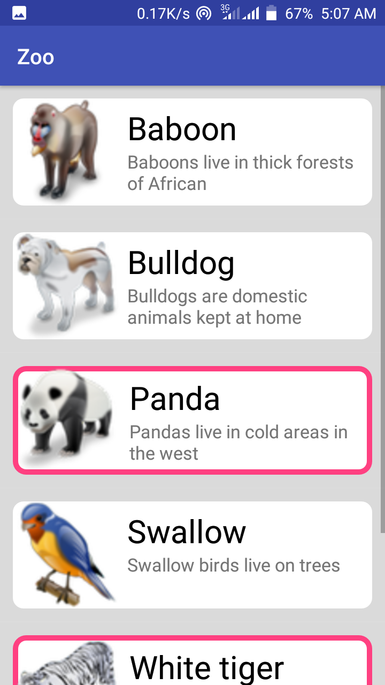
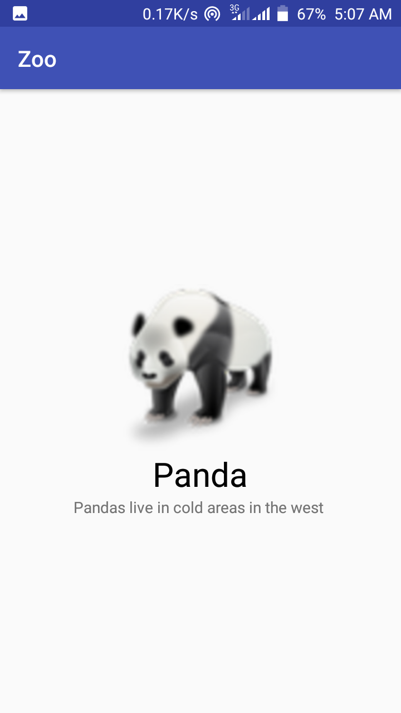

# Zoo App
|

This app can display animal list plus their images and name
.It can also display more details about each animal and 
dangerous animals have a red boundary. This is a simple 
app designed with only a listview and no card view. It's a beginner level project
that I did in my Android class.

## Table of Contents
* [Features](#features)
* [Setup](#setup)
* [License](#license)
### Features
* Card like view
* Clickable layout 
### Setup
* Install [Android studio](https://developer.android.com/studio)
* Install [Android Development Tools](https://docs.oracle.com/en/middleware/developer-tools/jet/tutorials/jetma/index.html)
####Gradle
    gradle-4.4-all.zip
####dependecies
    implementation "org.jetbrains.kotlin:kotlin-stdlib-jdk7:$kotlin_version"
    implementation 'com.android.support:appcompat-v7:27.1.1'
    implementation 'com.android.support.constraint:constraint-layout:1.1.3'
### License
This project is licensed under [MIT license](./LICENSE.md) terms